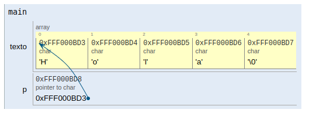

# Arreglos de caracteres y punteros en C++

## 1. Representación en memoria: caracteres ASCII

### Ejercicio 1.1 — El carácter como número

Analiza el siguiente código:

```cpp
#include <iostream>
using namespace std;

int main() {
    char c1 = 'A';
    char c2 = 'a';
    char c3 = '0';

    cout << (int)c1 << endl;
    cout << (int)c2 << endl;
    cout << (int)c3 << endl;
}
```
1. ¿Qué valores numéricos se imprimirán?

2. ¿Por qué 'A' y 'a' no tienen el mismo valor?

3. ¿Un char es realmente un carácter o un número? 

   El compilador no ve letras, solo números

4. ¿Cuántos bytes ocupa un char en memoria? 1 byte


### Ejercicio 1.2 — Comparaciones sospechosas

```cpp
char x = '9';

if (x > '5') {
    cout << "Mayor";
}

```
Aquí, no se comparan cifras, se comparan códigos ASCII


## 2. Aritmética limitada de caracteres
### Ejercicio 2.1 — ¿Se puede sumar caracteres?

```cpp
char c = 'A';
c = c + 1;
cout << c;
// 'A'  = 65
// 65 + 1 = 66 --> 'B'

// 'z' + 1 ?
```
La aritmética de caracteres no entiende semántica


### Ejercicio 2.2 — Convertir mayúscula a minúscula

```cpp
char c = 'D';
c = c + ('a' - 'A');

//'a' - 'A' = 32
```

Todas las minúsculas están desplazadas +32 en ASCII
por lo tanto, funciona por casualidad de estructura del ASCII


## 3. Arreglo de caracteres vs cadena de caracteres

### Ejercicio 3.1 — ¿Esto es una cadena?

```cpp
char arr1[5] = {'H','o','l','a','!'};
char arr2[5] = "Hola";
```

Una cadena válida debe terminar en '\0'.


### Ejercicio 3.2 — El carácter invisible

```cpp
char palabra[] = "UNI";
```

`"UNI"` tiene 3 caracteres visibles

pero 4 posiciones en memoria

La cadena termina cuando aparece el cero (caracter nulo `'\0'`) 


## 4. Punteros y cadenas de caracteres

### Ejercicio 4.1 — Arreglo vs puntero

```cpp
char texto[] = "Hola";
char* p = texto;
```



* texto se comporta como un puntero al primer caracter de la cadena (`'H'`)

* p es una variable puntero que almacena esa dirección

### Ejercicio 4.2 — Aritmética de punteros

```cpp
char palabra[] = "PERU";
char* p = palabra;

*(p + 1)
```

p apunta a 'P'

p + 1 apunta a 'E'

Se avanza 1 byte `(sizeof(char))`

Sumar a un puntero es avanzar posiciones, no sumar números.”

### Ejercicio 4.3 — Recorrer una cadena con punteros

```cpp
void imprimir(const char* p) {
    while (*p != '\0') {
        cout << *p;
        p++;
    }
}

```

Se recorre hasta encontrar el terminador. De esta manera se recorren cadenas las funciones  estándar.


## 5. Funciones de entrada de datos

### Ejercicio 5.1 — cin >> nombre

```cpp
char nombre[10];
cin >> nombre;

// El código puede detener el programa sin avisar
```

**Problemas**

No controla tamaño

Puede sobrescribir memoria

Provoca buffer overflow


### Ejercicio 5.2 — cin.getline

```cpp
cin.getline(frase, 50);

```

Lee hasta 49 caracteres

Agrega '\0'

Es más segura

Si el buffer está sucio, puede leer vacío. (use `cin.ignore()` para limpiar el buffer)


## 6. Funciones para el manejo de caracteres

### Ejercicio 6.1 — strlen

```cpp
#include <iostream>
#include <cstring>
using namespace std;

int main() {
    char texto[20] = "Hola";
    cout << strlen(texto) << endl;
}

``` 

* Cuenta caracteres antes de '\0'. No incluye el terminador

* Si no hay '\0' produce comportamiento indefinido

* strlen no sabe de tamaños, solo busca el caracter nulo.


### Ejercicio 6.2 — strcpy peligroso


```cpp
#include <iostream>
#include <cstring>
using namespace std;

int main() {
    char destino[5];
    char origen[] = "Programacion";

    strcpy(destino, origen);
}
```
* destino es un arreglo de 5 caracteres. Puede almacenar máximo 4 caracteres visibles + '\0'

* Copia hasta encontrar '\0'. No verifica tamaño.  Resultado:  Desbordamiento de memoria


### Ejercicio 6.3 — Comparar cadenas

```cpp
char a[] = "Hola";
char b[] = "Hola";

if (a == b) { // ERROR TÍPICO
    cout << "Iguales" << endl;
}

```
* Forma correcta
`if (strcmp(a, b) == 0)`

* a == b compara direcciones. `strcmp` compara contenido


* Compara carácter por carácter. Devuelve: 

        0 --> iguales

         < 0 --> a < b

         > 0 --> a > b


## 7. Arreglo de cadenas

Es un arreglo cuyos elementos son cadenas, y una cadena es: un arreglo de char terminado en '\0'

Por tanto, un arreglo de cadenas puede representarse como:

* un arreglo bidimensional de char, o

* un arreglo de punteros a char (forma más flexible)

### Forma 1 — Arreglo bidimensional (forma rígida)

```cpp
char paises[3][10] = {
    "Peru",
    "Chile",
    "Brasil"
};

```

* ¿Qué hay en memoria? 3 filas. cada fila tiene 10 caracteres

* Todas las cadenas tienen longitud máxima fija

* Se desperdicia memoria. No todas las palabras usan las 10 posiciones


### Forma 2 — Arreglo de punteros a char (forma eficiente)

```cpp
const char* paises[] = {
    "Peru",
    "Chile",
    "Brasil"
};
```


* ¿Qué es realmente paises? paises es un arreglo de punteros

* Cada puntero apunta a una cadena literal

* Ejemplo :

Índice	      Contenido
paises[0]	dirección de "Peru"
paises[1]	dirección de "Chile"
paises[2]	dirección de "Brasil"


### Recorrer un arreglo de cadenas con punteros
```cpp
for (int i = 0; i < 3; i++) {
    const char* p = *(paises + i);
    while (*p != '\0') {
        cout << *p;
        p++;
    }
    cout << endl;
}

```
* Un arreglo de cadenas es un arreglo de punteros,
y cada puntero se recorre como una cadena normal.


## 8. Uso adecuado de cadenas literales (const char*)

* ¿Qué es una cadena literal?
"Hola mundo". Es una cadena almacenada en memoria de solo lectura

* El compilador la crea automáticamente

* NO debe modificarse

* Error clásico del estudiante
```cpp
char* p = "Hola";
p[0] = 'h';   //  comportamiento indefinido
```
* ¿Por qué es un error? "Hola" es una cadena literal. Está en una región no modificable

* Intentar cambiarla puede: colgar el programa, generar error en tiempo de ejecución

* Forma correcta
```cpp
const char* p = "Hola";
```
* Si una cadena no debe cambiarse, el tipo debe decirlo.

* Si se quiere modificar la cadena

```cpp
char palabra[] = "Hola";
palabra[0] = 'h';   // correcto
```


## 9. Funciones para caracteres (<cctype>)

Estas funciones trabajan carácter por carácter.

Clasificación de caracteres
```cpp
isalpha(c)   // letra
isdigit(c)   // dígito
isalnum(c)   // letra o dígito
isspace(c)   // espacio, tabulación, salto de línea
```

* Uso típico:

```cpp
if (isdigit(c)) {
    // c es un dígito ASCII
}
```
```cpp
// Conversión de caracteres
toupper(c)
tolower(c)
```

* CUIDADO: No modifican la variable original:
```cpp
c = tolower(c);
```

## 10. Funciones para convertir cadenas de caracteres


### Ejercicio  10.1 Convertir cadena a número
```cpp
#include <cstdlib>

int x = atoi("123");     // 123
double y = atof("3.14"); // 3.14
```
* No detectan errores correctamente

* atoi confía demasiado en el usuario

### Ejercicio 10.2 Conversión carácter por carácter (manual)

```cpp
int numero = 0;
for (const char* p = "123"; *p != '\0'; p++) {
    numero = numero * 10 + (*p - '0');
}
```

* Note cómo una cadena se convierte en número
usando solo punteros y ASCII.


## 11 strtok — Separación de cadenas en tokens 

* ¿Para qué sirve strtok? strtok se usa para dividir una cadena en partes (tokens) usando uno o varios delimitadores.

Ejemplo:
```cpp
"Juan,Pedro,Ana"
```

Tokens resultantes:

"Juan"

"Pedro"

"Ana"

* Prototipo de strtok

```cpp
char* strtok(char* str, const char* delimitadores);
```

* strtok MODIFICA la cadena original, por ello No debe usarse con cadenas literales, solo con arreglos de char modificables

* Ejemplo:
```cpp
#include <iostream>
#include <cstring>
using namespace std;

int main() {
    char texto[] = "Juan,Pedro,Ana";

    char* token = strtok(texto, ",");

    while (token != nullptr) {
        cout << token << endl;
        token = strtok(nullptr, ",");
    }
}
```

* texto es un arreglo de char

* Contiene una cadena modificable

* Contenido inicial en memoria:

    `J u a n , P e d r o , A n a \0`

* ¿Qué hace strtok?

    Primera llamada: `token = strtok(texto, ",");`
    
    Busca el primer , lo reemplaza por '\0'. Devuelve un puntero al inicio del token

    * Memoria después:

    `J u a n \0 P e d r o , A n a \0`

    Segunda llamada: `token = strtok(nullptr, ",");`
    
    Continúa desde donde se quedó. Encuentra el siguiente , .Lo reemplaza por '\0'

    * Memoria:

    `J u a n \0 P e d r o \0 A n a \0`
    
    Última llamada : `token = strtok(nullptr, ",");`


    * Memoria:

    `J u a n \0 P e d r o \0 A n a \0`
                  

    * Siguiente llamada: `token = strtok(nullptr, ",");`
    
    * Devuelve nullptr --> fin del proceso.


    * strtok usa un estado interno estático:
      
      Guarda dónde se quedó
      
      nullptr significa: Sigue tokenizando la misma cadena


* ¿Qué delimitadores se pueden usar?
```cpp
strtok(texto, ",; ")
// Separa por coma punto y coma, espacio
```


### Error típico 1 — Usar strtok con cadenas literales
```cpp
char* p = "A,B,C";
char* t = strtok(p, ",");  // ERROR

// Comportamiento indefinido Porque "A,B,C" es solo lectura.

// Solución:

char texto[] = "A,B,C";
```

### Error típico 2 — Perder la cadena original

Después de usar strtok, la cadena: "Juan,Pedro,Ana" queda convertida en: "Juan\0Pedro\0Ana\0"

Es decir, la cadena original ya no existe.”


### Error típico 3 — Uso simultáneo
```cpp
strtok(cadena1, ",");
strtok(cadena2, ",");  // interfiere
```
